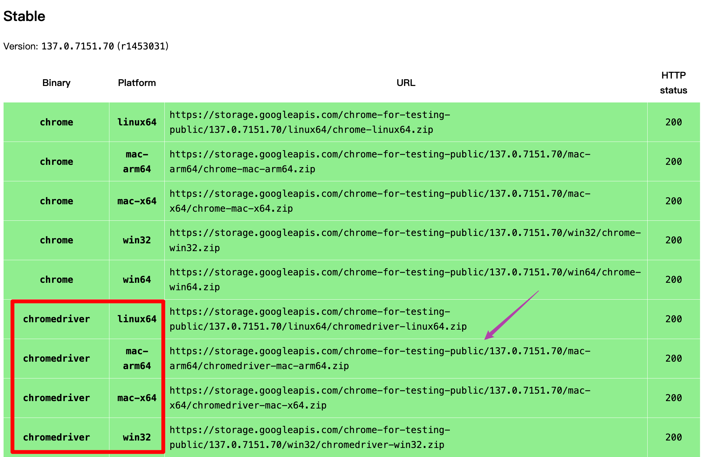

# ArXivCiteCount

This is a tool used to check the citation count of an arXiv paper!

<!-- PROJECT SHIELDS -->

[![Contributors][contributors-shield]][contributors-url]
[![Forks][forks-shield]][forks-url]
[![Stargazers][stars-shield]][stars-url]
[![Issues][issues-shield]][issues-url]
[![MIT License][license-shield]][license-url]
[![LinkedIn][linkedin-shield]][linkedin-url]

<!-- PROJECT LOGO -->
<br />

<p align="center">
  <a href="https://github.com/dogeeelin/ArXiv-Cite-Count/">
    
  </a>

  <h3 align="center">ArXivCiteCount</h3>
  <p align="center">
    帮助你了解一篇ArXiv论文的引用量
    <br />
    <a href="https://github.com/dogeeelin/ArXiv-Cite-Count/"><strong>« 探索本项目的文档 »</strong></a>
    <br />
    <br />
    <a href="https://github.com/shaojintian/Best_README_template">查看Demo</a>
    ·
    <a href="https://github.com/dogeeelin/ArXiv-Cite-Count/issues">报告Bug</a>
    ·
    <a href="https://github.com/dogeeelin/ArXiv-Cite-Count/issues">提出新特性</a>
  </p>

</p>


 本篇README.md面向开发者
 
## 目录

- [ArXivCiteCount](#arxivcitecount)
  - [目录](#目录)
    - [上手指南](#上手指南)
          - [开发前的配置要求](#开发前的配置要求)
          - [**安装步骤**](#安装步骤)
    - [文件目录说明](#文件目录说明)
    - [版权说明](#版权说明)

### 上手指南


###### 开发前的配置要求
- Python: 3.9.19
- selenium: 4.28.1
- python-dotenv: 1.0.1

###### **安装步骤**

1. Download a chromedriver at [google chromedriver](https://googlechromelabs.github.io/chrome-for-testing/). 
2. Clone the repo
    ```sh
    git clone https://github.com/dogeeelin/ArXiv-Cite-Count.git
    ```
3. Install requirements
    ```python
    pip install requirements.txt
    ```
4. Run the file
    ```python
    python get-cite-count-latest.py  
    ```
       

### 文件目录说明
```
filetree
├── asset
│   └── chromedriver.png
├── .env
├── .gitignore
├── README.md
├── get-cite-count-latest.py
├── get-cite-count.py
└── requirements.txt
```

### 版权说明

该项目签署了MIT 授权许可，详情请参阅 [LICENSE.txt](https://github.com/dogeeelin/ArXiv-Cite-Count/blob/master/LICENSE.txt)


<!-- links -->
[your-project-path]:shaojintian/Best_README_template
[contributors-shield]: https://img.shields.io/github/contributors/shaojintian/Best_README_template.svg?style=flat-square
[contributors-url]: https://github.com/dogeeelin/ArXiv-Cite-Count/graphs/contributors
[forks-shield]: https://img.shields.io/github/forks/shaojintian/Best_README_template.svg?style=flat-square
[forks-url]: https://github.com/dogeeelin/ArXiv-Cite-Count/network/members
[stars-shield]: https://img.shields.io/github/stars/shaojintian/Best_README_template.svg?style=flat-square
[stars-url]: https://github.com/dogeeelin/ArXiv-Cite-Count/stargazers
[issues-shield]: https://img.shields.io/github/issues/shaojintian/Best_README_template.svg?style=flat-square
[issues-url]: https://img.shields.io/github/issues/shaojintian/Best_README_template.svg
[license-shield]: https://img.shields.io/github/license/shaojintian/Best_README_template.svg?style=flat-square
[license-url]: https://github.com/dogeeelin/ArXiv-Cite-Count/blob/master/LICENSE.txt
[linkedin-shield]: https://img.shields.io/badge/-LinkedIn-black.svg?style=flat-square&logo=linkedin&colorB=555
[linkedin-url]: https://linkedin.com/in/shaojintian


